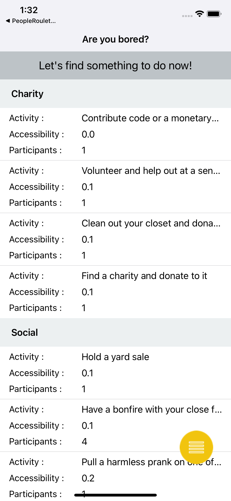
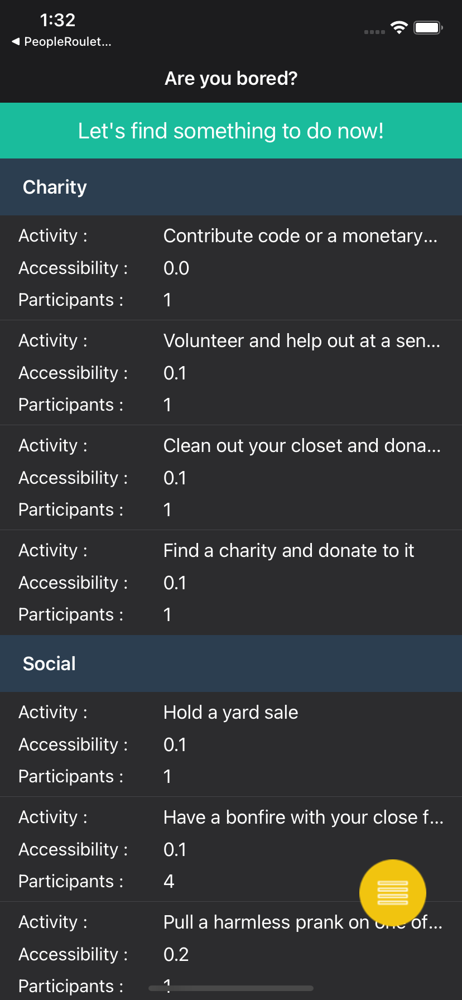
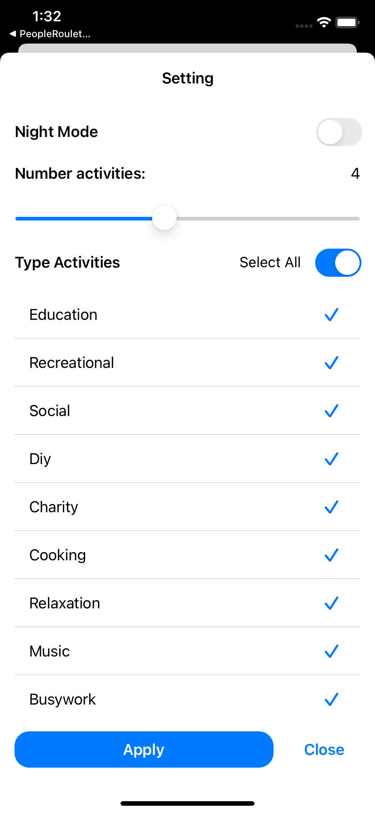
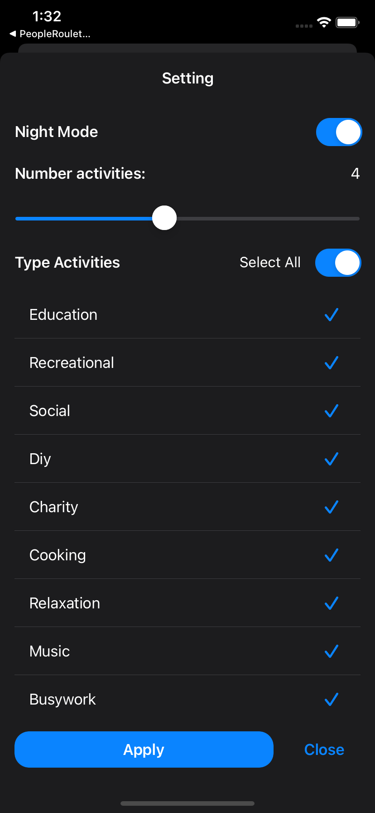
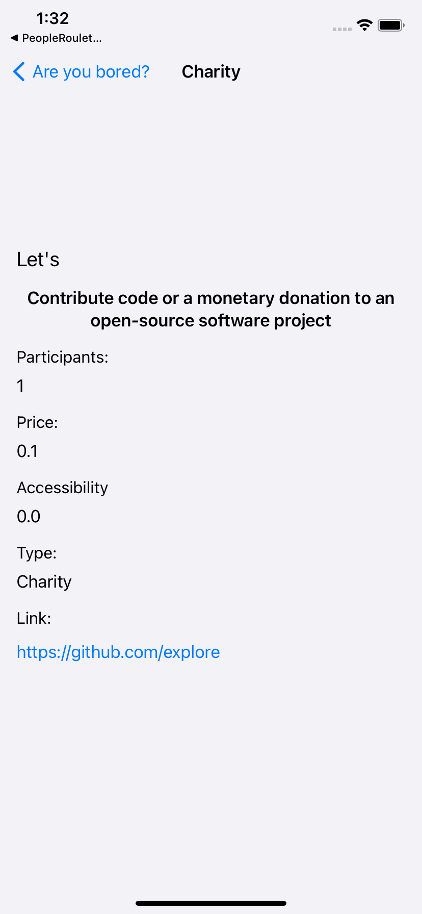
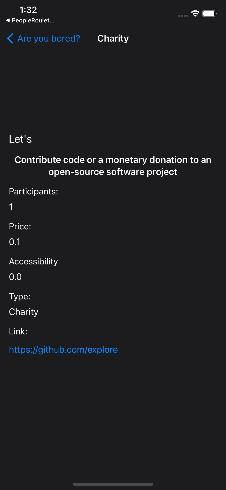

# Bored App MVVM with RxSwift + UserDefaults

App with a single page that downloads a list of activities from the API at https://www.boredapi.com.

Implementing MVVM concept with RxSwift and using UserDefaults to store user's settings.

### Usage

- Clone
- `pod install`
- Open xcworkspace

### Fastlane

- Install Fastlane (https://docs.fastlane.tools/)
- `fastlane tests`

### Screenshots

* Home

* Setting

* Detail

